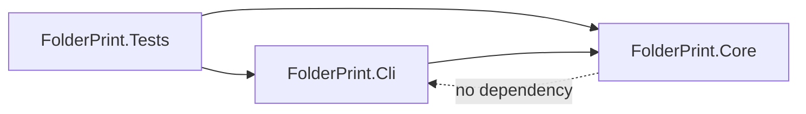
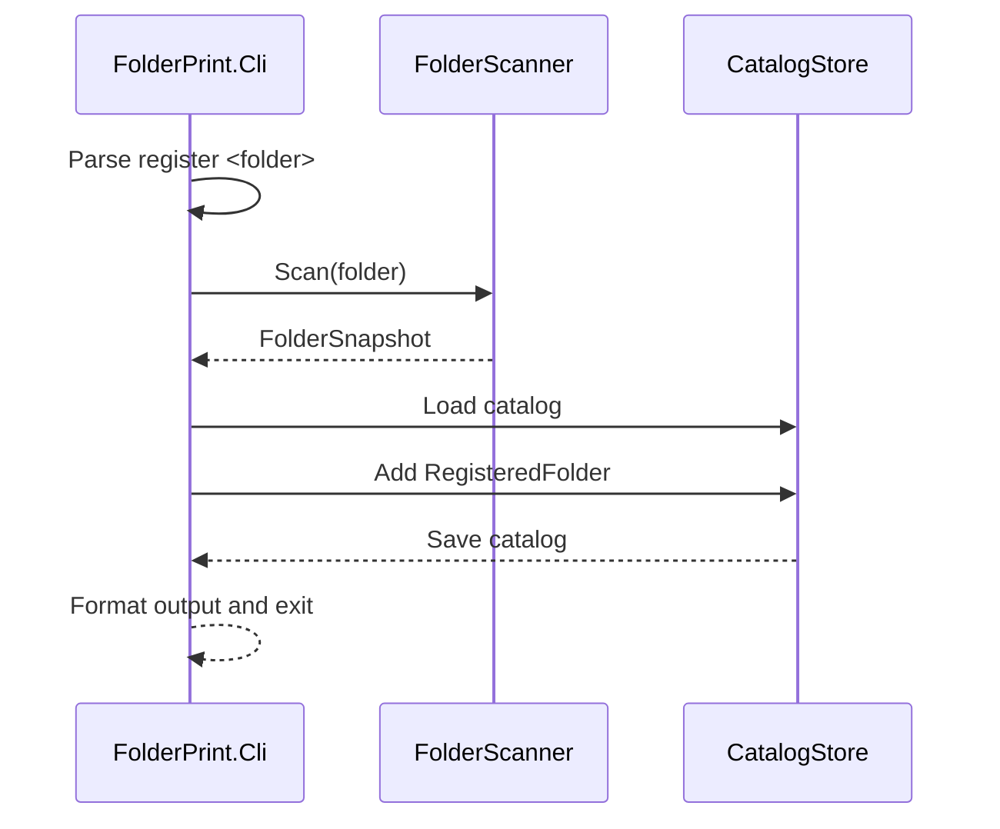
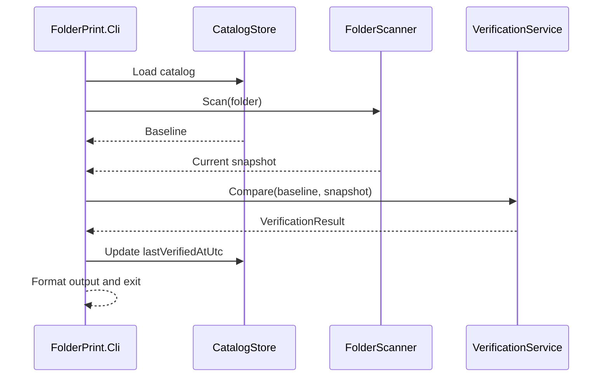
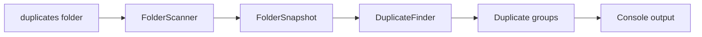
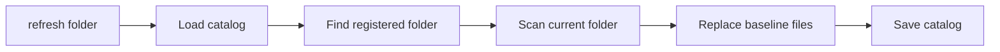
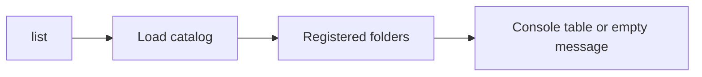
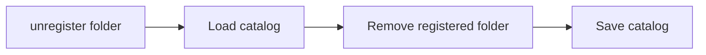

# Technical Architecture: FolderPrint

## Architecture Overview

FolderPrint V1 uses a layered CLI/Core architecture. `FolderPrint.Cli` is the executable adapter: it parses commands, validates arguments, calls Core services, formats console output, and maps outcomes to process exit codes. `FolderPrint.Core` owns the product behavior: folder scanning, SHA-256 hashing, comparison, duplicate detection, catalog persistence, and report data structures.

The central rule is dependency direction:



Core code must be usable without console I/O. This keeps business logic testable and prevents console formatting decisions from leaking into integrity behavior.

## Folder and Project Structure

```text
FolderPrint.sln
src/
  FolderPrint.Cli/
    Program.cs
    CommandParser.cs
    CommandDispatcher.cs
    ConsoleOutput.cs
    ExitCodes.cs
  FolderPrint.Core/
    Catalog/
      IntegrityCatalog.cs
      CatalogStore.cs
      CatalogPathProvider.cs
    Scanning/
      FolderScanner.cs
      FileHasher.cs
    Verification/
      VerificationService.cs
      DuplicateFinder.cs
    Reporting/
      ReportFormatter.cs
    Models/
      RegisteredFolder.cs
      FileFingerprint.cs
      FolderSnapshot.cs
      VerificationResult.cs
      FileChange.cs
      FileChangeType.cs
tests/
  FolderPrint.Tests/
    Catalog/
    Scanning/
    Verification/
    Cli/
```

Project references:

- `FolderPrint.Cli` references `FolderPrint.Core`.
- `FolderPrint.Core` references only platform libraries and approved minimal dependencies.
- `FolderPrint.Tests` references both projects, with most tests aimed at `FolderPrint.Core`.

## Component Responsibilities

| Component | Project | Responsibility |
| --- | --- | --- |
| `CommandParser` | `FolderPrint.Cli` | Parses V1 commands and arguments into command request objects. |
| `CommandDispatcher` | `FolderPrint.Cli` | Calls the correct Core service for each parsed command. |
| `ConsoleOutput` | `FolderPrint.Cli` | Writes user-facing command output. |
| `ExitCodes` | `FolderPrint.Cli` | Defines stable process exit code constants. |
| `FolderScanner` | `FolderPrint.Core` | Walks a folder and returns a `FolderSnapshot` with fingerprints and unreadable files. |
| `FileHasher` | `FolderPrint.Core` | Computes SHA-256 hashes using `System.Security.Cryptography.SHA256`. |
| `IntegrityCatalog` | `FolderPrint.Core` | Represents registered folders and file fingerprints in memory. |
| `CatalogStore` | `FolderPrint.Core` | Loads and saves the JSON catalog using `System.Text.Json`. |
| `CatalogPathProvider` | `FolderPrint.Core` | Resolves `%AppData%\FolderPrint\catalog.json` for V1. |
| `VerificationService` | `FolderPrint.Core` | Compares a current scan with a baseline and produces `VerificationResult`. |
| `DuplicateFinder` | `FolderPrint.Core` | Groups current readable files by SHA-256 hash. |
| `ReportFormatter` | `FolderPrint.Core` | Converts report data into display-ready sections without writing to the console. |

## Domain Models

### `RegisteredFolder`

Represents one trusted folder baseline in the catalog.

- `Id`
- `RootPath`
- `CreatedAtUtc`
- `LastVerifiedAtUtc`
- `Files`

### `FileFingerprint`

Represents one readable file at scan time.

- `RelativePath`
- `Sha256`
- `Size`
- `LastModifiedUtc`

### `FolderSnapshot`

Represents the result of scanning a folder.

- `RootPath`
- `ScannedAtUtc`
- `Files`
- `UnreadableFiles`

### `VerificationResult`

Represents comparison output for `verify`.

- `RootPath`
- `VerifiedAtUtc`
- `Changes`
- `DuplicateGroups`
- `UnreadableFiles`
- `HasDifferences`

### `FileChange`

Represents one classified verification finding.

- `Type`
- `BaselineRelativePath`
- `CurrentRelativePath`
- `Sha256`
- `Message`

### `FileChangeType`

Enumeration:

- `Unchanged`
- `Modified`
- `Missing`
- `New`
- `MovedOrRenamed`
- `Duplicate`
- `Unreadable`

## Main Data Flows

### Register



Rules:

- Registration fails if the folder does not exist, is already registered, or contains unreadable files.
- Registration creates a trusted baseline only after a complete successful scan.

### Verify



Rules:

- Same path and same hash is `Unchanged`.
- Same path and different hash is `Modified`.
- Baseline-only path is `Missing`, unless matched as moved or renamed.
- Current-only path is `New`, unless matched as moved or renamed.
- Same hash at a different path is `MovedOrRenamed` when unambiguous.
- Duplicate hashes that make move detection ambiguous must be reported as ambiguous.

### Duplicates



Rules:

- `duplicates <folder>` may run against any existing folder, registered or not.
- Unreadable files are reported separately and excluded from duplicate groups.

### Refresh



Rules:

- Refresh requires an existing registered folder.
- Refresh preserves `id` and `createdAtUtc`.
- Refresh replaces baseline files only after a successful scan.

### List



### Unregister



Rules:

- Unregister removes only catalog data.
- It must never delete or modify files in the target folder.

## JSON Catalog Schema

V1 catalog path on Windows:

```text
%AppData%\FolderPrint\catalog.json
```

Schema seed:

```json
{
  "registeredFolders": [
    {
      "id": "string",
      "rootPath": "C:\\Example\\Folder",
      "createdAtUtc": "2026-07-07T00:00:00Z",
      "lastVerifiedAtUtc": "2026-07-07T00:00:00Z",
      "files": [
        {
          "relativePath": "docs/example.txt",
          "sha256": "hex-encoded-sha256",
          "size": 1234,
          "lastModifiedUtc": "2026-07-07T00:00:00Z"
        }
      ]
    }
  ]
}
```

Schema conventions:

- JSON field names use camelCase.
- Timestamps are UTC ISO-8601 strings.
- SHA-256 values are lowercase hex strings.
- Relative paths are stored with normalized separators chosen by the implementation and covered by tests.
- New fields may be added later, but V1 tests pin the required fields.

## Error Handling Strategy

Core services return result objects that distinguish success, expected user errors, and unexpected failures. CLI maps those results to output and exit codes.

Expected user errors include:

- Unknown command.
- Missing required folder argument.
- Folder does not exist.
- Path exists but is not a directory.
- Folder is not registered.
- Folder is already registered.
- Catalog JSON is invalid.
- Catalog cannot be read or written.
- Files are unreadable during scan.
- Verification detects drift.

Core must not write directly to `Console`. CLI must not inspect raw exceptions when a typed Core result can express the outcome.

## Exit Code Strategy

Use named constants in `FolderPrint.Cli.ExitCodes`.

| Code | Name | Meaning |
| --- | --- | --- |
| 0 | `Success` | Command completed successfully and no verification drift was detected. |
| 1 | `DifferencesFound` | Verification completed and found changes, duplicates, or unreadable files. |
| 2 | `UsageError` | Unknown command, missing argument, or invalid argument shape. |
| 3 | `NotFound` | Folder or registered catalog entry was not found. |
| 4 | `CatalogError` | Catalog read, parse, or write failed. |
| 5 | `ScanError` | Folder scan could not complete reliably. |
| 10 | `UnexpectedError` | Unhandled unexpected failure. |

Downstream stories may adjust numeric values only if all CLI tests and documentation update together.

## Testing Strategy

Testing uses xUnit.

Primary focus:

- `FileHasher` produces stable SHA-256 output.
- `FolderScanner` returns relative paths, sizes, timestamps, unreadable-file results, and nested files correctly.
- `VerificationService` classifies unchanged, modified, missing, new, moved or renamed, duplicate, ambiguous, and unreadable cases.
- `DuplicateFinder` groups current files by hash.
- `CatalogStore` creates, reads, writes, and rejects malformed JSON.
- `CommandParser` accepts V1 commands and rejects invalid shapes.
- CLI dispatch maps Core results to exit codes without requiring brittle assertions on full console prose.

Test isolation:

- Use temporary directories for filesystem tests.
- Inject catalog paths instead of writing to the real `%AppData%` path in tests.
- Keep console-output tests narrow and focused on required labels or summaries.

## Naming Conventions

- Projects use `FolderPrint.Cli`, `FolderPrint.Core`, and `FolderPrint.Tests`.
- Public domain types use PascalCase nouns.
- Enum values use PascalCase, including `MovedOrRenamed`.
- JSON fields use camelCase.
- Service classes use explicit role names: `FolderScanner`, `FileHasher`, `VerificationService`, `DuplicateFinder`, `CatalogStore`.
- Tests use `MethodOrScenario_Condition_ExpectedOutcome` naming where practical.

## Architecture Decisions

### AD-1: Layered CLI/Core boundary [ADOPTED]

- **Binds:** all commands, all Core services.
- **Prevents:** command parsing, console output, and exit-code concerns leaking into file-integrity logic.
- **Rule:** `FolderPrint.Cli` may depend on `FolderPrint.Core`; `FolderPrint.Core` must not depend on `FolderPrint.Cli` or `System.Console`.

### AD-2: Core owns file integrity behavior [ADOPTED]

- **Binds:** scanning, hashing, verification, duplicate detection, catalog persistence, report data.
- **Prevents:** duplicate business rules across commands.
- **Rule:** Commands call Core services for behavior; CLI code only orchestrates input, output, and exit mapping.

### AD-3: JSON catalog for V1 [ADOPTED]

- **Binds:** FR-1 through FR-4, catalog persistence, tests.
- **Prevents:** premature database design and opaque local state.
- **Rule:** V1 persists registered folders and file fingerprints in human-inspectable JSON using `System.Text.Json`.

### AD-4: Minimal dependency policy [ADOPTED]

- **Binds:** all projects.
- **Prevents:** dependency growth before the command surface requires it.
- **Rule:** V1 uses .NET platform libraries for hashing and JSON, plus xUnit for tests. New runtime dependencies require an explicit architecture update.

### AD-5: Manual CLI parser for V1 [ADOPTED]

- **Binds:** FR-19, command parsing.
- **Prevents:** introducing a CLI framework for six simple commands.
- **Rule:** Implement a small manual parser for `register`, `verify`, `list`, `unregister`, `duplicates`, and `refresh`. Revisit `System.CommandLine` only when options, nested commands, completions, or help complexity justify it.

### AD-6: Typed results before console formatting [ADOPTED]

- **Binds:** `VerificationResult`, `FileChange`, `ReportFormatter`, CLI output.
- **Prevents:** tests depending on console prose and commands inventing their own report shapes.
- **Rule:** Core returns typed result data. Formatting is a separate step. Console output is the final adapter.

### AD-7: Test with injectable paths [ADOPTED]

- **Binds:** catalog and scanner tests.
- **Prevents:** tests mutating the real user catalog under `%AppData%`.
- **Rule:** catalog path resolution must be replaceable in tests.

## Explicit V1 Exclusions

- GUI.
- SQLite or other database storage.
- Cloud backup integration.
- Real-time file monitoring.
- Encryption.
- Network share support as a guaranteed scenario.
- Very large-scale optimization.
- Complex ignore rules.
- `export-report` command.
- Shell completion or advanced CLI framework behavior.

## Deferred

- Cross-platform catalog path policy beyond the Windows `%AppData%` seed.
- Exact relative path separator normalization rule.
- Whether `lastVerifiedAtUtc` updates after verification that detects drift.
- Whether empty folder registration is valid.
- Whether `register` should later support an overwrite flag.
- Machine-readable report output for post-V1 automation.
